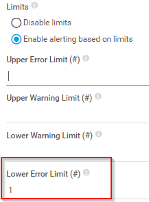
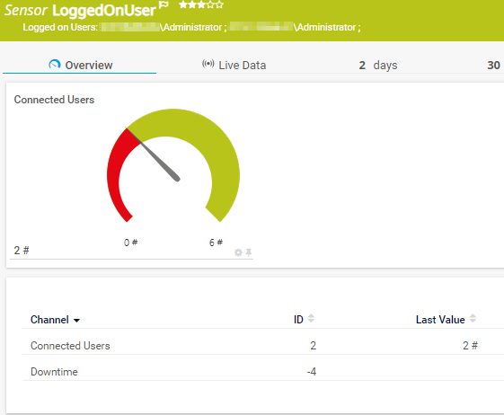
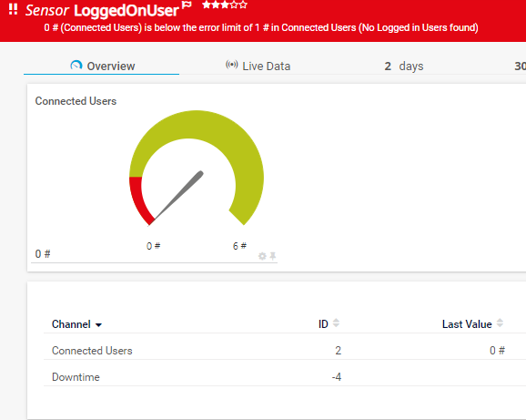

# PRTG-LoggedOnUser
# About

## Project Owner:

Jannos-443

## Project Details

Using WinRM and WMI this script counts logged on users.

You can exclude users or include only one or two users.

## HOW TO

1. Place `PRTG-LoggedOnUser.ps1` under `C:\Program Files (x86)\PRTG Network Monitor\Custom Sensors\EXEXML`

2. Create new Sensor 

   | Settings | Value |
   | --- | --- |
   | EXE/Script | PRTG-LoggedOnUser.ps1 |
   | Parameters | -ComputerName %host |
   | Security Context | Use Windows credentials of parent device" or use "-Username" and "-Password" |
   
3. If needed set the "$IncludePattern" or "$ExcludePattern" parameter to include or exclude users

If you connect to **Computers by IP** or to **not Domain Clients** please read [Microsoft Docs](https://docs.microsoft.com/en-us/powershell/module/microsoft.powershell.core/about/about_remote_troubleshooting?view=powershell-7.1#how-to-use-an-ip-address-in-a-remote-command)

you maybe have to add the target to the TrustedHosts on the PRTG Probe 

example: `Set-Item -Path WSMan:\localhost\Client\TrustedHosts -Value "IPAdressOfMyTarget,HostnameOfMyTarget"`

## Examples
check if the user "TestUserContoso" is logged on and if not show an Error

set `PRTG-LoggedOnUser.ps1 -ComputerName %host -IncludePattern '(TestUserContoso)'` and set the `Lower Error Limit`

Exceptions
------------------
You can either use the **parameter $IncludePattern** or **$ExcludePattern** to exclude on sensor basis, or set the **variable $ExcludeScript** within the script. Both variables take a regular expression as input to provide maximum flexibility. These regexes are then evaluated againt the **Username**

For more information about regular expressions in PowerShell, visit [Microsoft Docs](https://docs.microsoft.com/en-us/powershell/module/microsoft.powershell.core/about/about_regular_expressions).

".+" is one or more charakters
".*" is zero or more charakters
